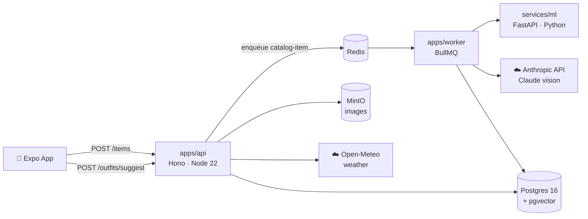

# Wardrobe App

**Photograph your closet once. Never wonder "what do I wear?" again.**

---

## What it is

Wardrobe App is an AI-powered wardrobe assistant you host yourself. Photograph each item in your closet — a pipeline strips the background, extracts dominant colors, generates a CLIP embedding, and uses Claude's vision to tag category, formality, season, style, and pattern. Your clothes live in a structured database, not a chat window.

The core of the product is the **outfit compatibility engine**: combinatorial search over your actual closet, ranked on a five-factor weighted score built from color theory, embedding similarity, formality consistency, pattern balance, and novelty. When you tap "What should I wear?", it filters by today's weather and your occasion, then surfaces 3–5 ranked outfit cards — each built from clothes you already own.

This is v1, self-hosted, and built for personal use. The backend runs with `docker compose up`. The mobile app runs via Expo Go during development, or as a native build through EAS. Your closet data stays on your machine.

---

## Screenshots


| Closet | Suggest | Builder |
|---|---|---|
|  |  |  |  |  |

[Demo](./docs/demo.mp4)

---

## Architecture

A pnpm monorepo — TypeScript apps + a Python ML service, wired together with Redis queues and a shared Postgres database.



| Package / App | What it does |
|---|---|
| `apps/api` | Hono REST API — auth, item CRUD, outfit suggestion, wear logging, weather proxy |
| `apps/worker` | BullMQ worker — runs the cataloging pipeline (ML service → Claude → DB) |
| `apps/mobile` | Expo / React Native app — the entire mobile UI |
| `services/ml` | Python FastAPI service — background removal, dominant-color extraction, CLIP embedding |
| `packages/db` | Drizzle schema + migrations for Postgres 16 + pgvector |
| `packages/shared` | Shared TypeScript types and constants (item enums, `MAX_WARDROBE_SIZE`) |
| `packages/outfit-engine` | The compatibility engine — pure TS, no I/O, fully unit-tested |

---

## Tech Stack

| Layer | Choice |
|---|---|
| Mobile | React Native + Expo (Expo Router, Expo Camera, Expo Image) |
| API | TypeScript · Hono · Node 22 |
| Job queue | BullMQ + Redis |
| ML service | Python · FastAPI · rembg · open-clip |
| Database | Postgres 16 + pgvector |
| ORM | Drizzle ORM |
| LLM — item tagging | Claude Sonnet (vision) via Anthropic API |
| LLM — outfit critique | Claude Haiku via Anthropic API |
| Color extraction | k-means over cutout pixels (Python) |
| Weather | Open-Meteo API (no key required) |
| Image storage | MinIO (self-hosted, S3-compatible) |
| Auth | Email + password · bcrypt · session cookies |

---

## Quick Start

### Prerequisites

- **Node 22+** and **pnpm** — `npm i -g pnpm`
- **Docker** (Desktop or Engine) with Compose v2
- **Python 3.11+** — only needed if running the ML service outside Docker
- An **[Anthropic API key](https://console.anthropic.com/)**

### 1 — Clone and install

```bash
git clone https://github.com/alanlisowski/wardrobe-app.git
cd wardrobe-app
pnpm install
```

### 2 — Configure environment

```bash
cp .env.example .env
```

Open `.env` and set these values:

```env
# Anthropic API key (required)
ANTHROPIC_API_KEY=sk-ant-...

# Session secret — generate one with: openssl rand -hex 32
SESSION_SECRET=paste-openssl-output-here

# MinIO credentials (defaults are fine for local dev)
S3_ACCESS_KEY=wardrobe
S3_SECRET_KEY=changeme123

# ⚠️  IMPORTANT when testing on a real phone:
# Set this to your machine's LAN IP — not localhost.
# Your phone needs to reach this URL to load item images.
# Find your IP: ipconfig (Windows) | ip addr (Linux) | ifconfig (Mac)
MINIO_PUBLIC_URL=http://192.168.1.15:9000
```

> **Why the LAN IP?** Image URLs are written into the database at cataloging time. If you leave this as `localhost`, the URL works fine on your laptop but your phone can't reach it. Set it once before your first upload.

### 3 — Start infrastructure

```bash
pnpm infra:up
```

This brings up four Docker services: `postgres` (pgvector-enabled), `redis`, `minio`, and `ml` (the Python FastAPI image). The ML image is built on first run and downloads model weights — allow a few minutes.

```bash
# Check all four are running:
docker compose ps
```

MinIO console: `http://localhost:9001` (user: `wardrobe` / pass: `changeme123`)

### 4 — Run migrations

```bash
pnpm db:generate
pnpm db:migrate
```

### 5 — Start the API and worker

Open two terminal tabs:

```bash
# Tab 1 — API (hot-reload via tsx)
pnpm dev:api

# Tab 2 — BullMQ worker
pnpm dev:worker
```

The API is available at `http://localhost:3001`. Verify: `http://localhost:3001/health`

### 6 — Run the mobile app

```bash
pnpm dev:mobile
```

Scan the QR code with **[Expo Go](https://expo.dev/go)** on iOS or Android. Both your phone and laptop must be on the same Wi-Fi network.

---

## The Outfit Compatibility Engine

> Source: `packages/outfit-engine` — pure TypeScript, zero I/O, fully unit-tested.

Given a closet and a context (`{ temperature, occasion }`), the engine returns ranked outfits in four steps:

**Step 1 — Hard filter.** Items are dropped if they fail hard constraints:
- Season mismatch (unless the item is tagged `all`).
- Warmth grossly wrong for the temperature (e.g. `warmth ≥ 4` on a 25 °C day).
- Formality outside the occasion's band (e.g. `formality ≤ 2` excluded for a formal occasion).

**Step 2 — Generate candidates.** Valid slot combinations are enumerated. An outfit requires `(top + bottom)` **or** `dress`, plus `footwear`; `outerwear` and up to 2 `accessories` are optional.

**Step 3 — Score.** Each candidate gets a weighted composite score (0–100):

| Sub-score | Weight | How it's computed |
|---|---|---|
| **Color harmony** | **0.30** | See algorithm below |
| **Style coherence** | **0.30** | Mean pairwise cosine similarity of CLIP embeddings |
| **Formality consistency** | **0.15** | `1 − normalized_stddev(formality values)` — tight spread wins |
| **Pattern balance** | **0.15** | One pattern + solids → 1.0 · all solid → 0.8 · two patterns → 0.4 · 3+ → 0.1 |
| **Novelty** | **0.10** | Rewards items with an older `last_worn_at` — surfaces forgotten clothes |

**Step 4 — Rank & dedupe.** Sort descending. Drop near-duplicates (outfits sharing 3+ items with a higher-ranked one). Return the top 3–5.

### The color-harmony algorithm

Each item's dominant colors are stored as `[{ hex, proportion }]` from the cataloging pipeline. The algorithm:

1. Gather dominant colors from all outfit items, weighted by pixel proportion and garment prominence (tops/bottoms count more than accessories).
2. Convert each color to **HSL**.
3. Classify as **neutral** (saturation < ~15%, near-black/white, or recognized neutral hues — beige, navy, tan, brown) vs. **accent** (chromatic).
4. Score the resulting palette:
   - All neutral → **0.80** (safe, slightly flat)
   - Neutrals + 1 accent → **1.00** (ideal — one pop of color)
   - Neutrals + 2 accents → judge the hue angle: analogous 0–40° → **0.95**, complementary 150–210° → **0.90**, triadic ~120° → **0.85**, awkward angle → **0.50**
   - 3+ accents → **0.30** (too busy)
5. Apply small penalties for two highly-saturated colors competing for attention.

The algorithm is explainable, whiteboard-able, and grounded directly in color theory.

---

## API Endpoints

All routes require a session cookie (set on `POST /auth/login`). Errors return `{ "error": "...", "code": "..." }`.

### Auth

| Method | Path | Description |
|---|---|---|
| `POST` | `/auth/signup` | Create account, set session cookie |
| `POST` | `/auth/login` | Log in, set session cookie |
| `POST` | `/auth/logout` | Destroy session |
| `GET` | `/auth/me` | Current user |
| `PATCH` | `/auth/me` | Update home location (`lat`, `lon`) for weather lookups |

### Items

| Method | Path | Description |
|---|---|---|
| `POST` | `/items` | Upload photo (multipart); enqueues cataloging; 409 at the 150-item cap |
| `GET` | `/items` | List closet — filterable by `category`, `season`, `q` |
| `GET` | `/items/:id` | Single item — poll `procStatus` until `"ready"` |
| `PATCH` | `/items/:id` | Edit AI-generated tags |
| `DELETE` | `/items/:id` | Remove item |

### Outfits

| Method | Path | Description |
|---|---|---|
| `POST` | `/outfits/suggest` | Get 3–5 ranked outfit suggestions (weather-aware) |
| `POST` | `/outfits/score` | Score an ad-hoc outfit + get a Claude critique (not persisted) |
| `POST` | `/outfits` | Save an outfit |
| `GET` | `/outfits` | List saved outfits |
| `GET` | `/outfits/:id` | Single outfit with score breakdown |
| `DELETE` | `/outfits/:id` | Delete outfit |

### Wears

| Method | Path | Description |
|---|---|---|
| `POST` | `/wears` | Log a wear event; bumps `wear_count` + `last_worn_at` on each item |
| `GET` | `/wears` | Wear history (filter by `from` / `to` date) |

### Weather

| Method | Path | Description |
|---|---|---|
| `GET` | `/weather` | Current temp + condition via Open-Meteo, using the user's saved `lat`/`lon` |

---

## ML Service

`services/ml` is a Python / FastAPI service with a single public endpoint: `POST /process`.

Given a raw clothing photo it returns — in one pass:

- A **background-removed PNG cutout** via [rembg](https://github.com/danielgatis/rembg) (BiRefNet model). Cutouts are what make flat-lay outfit cards look professional.
- **Dominant colors** — `[{ hex, proportion }]` from k-means over the non-transparent cutout pixels. These drive the color-harmony algorithm.
- A **512-dimensional CLIP ViT-B/32 embedding** of the cutout. This drives style-coherence scoring.

The BullMQ worker calls this endpoint immediately after an item is uploaded. The service runs in Docker via `pnpm infra:up`. To run it standalone:

```bash
cd services/ml
pip install -r requirements.txt
uvicorn main:app --reload --port 8000
```

---

## Project Structure

```
wardrobe-app/
├── apps/
│   ├── api/            Hono REST API (TypeScript, Node 22)
│   ├── worker/         BullMQ cataloging worker (TypeScript)
│   └── mobile/         Expo / React Native app
├── services/
│   └── ml/             FastAPI ML service (Python) — bg removal, colors, CLIP
├── packages/
│   ├── db/             Drizzle ORM schema + migrations (Postgres 16 + pgvector)
│   ├── outfit-engine/  Compatibility engine — pure TS, no I/O, unit-tested
│   └── shared/         Shared TypeScript types and constants
├── docs/
│   └── screenshots/    App screenshots (add yours here)
├── docker-compose.yml  Postgres, Redis, MinIO, ML service
├── .env.example        Environment variable template
├── BUILD-PHASES.md     Phased build plan
├── SPEC.md             Full v1 specification (source of truth)
└── package.json        pnpm workspace root
```

---

## Known Limitations & Roadmap

**Current v1 limitations:**
- One photo per item — batch cataloging (AI separating a pile) is not implemented.
- Engine scoring weights are fixed constants; no per-user personalization yet.
- Outfit cards are flat-lay cutout grids, not composited on a body or mannequin.
- 150-item wardrobe cap (configurable via `MAX_WARDROBE_SIZE` in `packages/shared`).
- No social features, outfit sharing, or multi-person closets.

**Planned for v1.5 / v2:**
- Personalization layer — users rate suggestions; weights become per-user learned values.
- "Stopped wearing" / declutter surfacing.
- Mannequin / on-body outfit compositing.
- Calendar integration.
- Cost-per-wear tracking.
- Wardrobe gap analysis and capsule analysis.

See [`SPEC.md`](./SPEC.md) for the complete v1 spec and [`BUILD-PHASES.md`](./BUILD-PHASES.md) for the phased build plan.

---

## License

[MIT](./LICENSE)

---

## Acknowledgements

- **[Anthropic Claude](https://www.anthropic.com/)** — Claude Sonnet for vision-based item tagging; Claude Haiku for outfit critique narration
- **[open-clip](https://github.com/mlfoundations/open_clip)** — CLIP ViT-B/32 embeddings for style-coherence scoring
- **[rembg](https://github.com/danielgatis/rembg)** — background removal (BiRefNet / u2net)
- **[Open-Meteo](https://open-meteo.com/)** — free, no-key-required weather API
- **[pgvector](https://github.com/pgvector/pgvector)** — vector similarity search in Postgres
